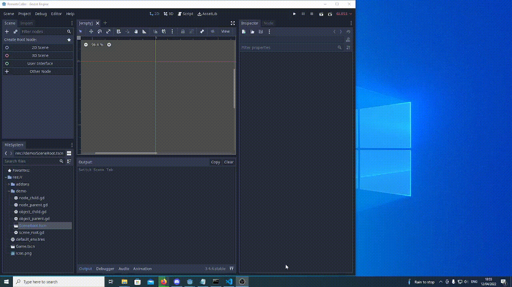

# Remote Caller

Remote Caller is an EditorInspectorPlugin for Godot Game Engine that allows users to call functions and
emit signals with various parameters in game from their a few clicks on the Inspector

# Features

You can call any function* (with any number of parameters) and or emit a signal (with any number of parameters) on any object that you can inspect

<i>We've intentionally blocked a few of the major Engine Callbacks to save you from yourself but feel free to go into to "res://addons/remote_caller/callable_property.gd" if you must.</i>

# Quick Setup

0. ( Refer to the gif at the top for visual instruction )
1. Download the latest release
2. Unzip it
3. Add the unzipped folder to your project's addons folder
4. Project -> Project Settings -> Plugin Tab -> Enable "Remote Caller"
5. Run your project
6. Click "Remote" in the Scene Tree Dock
7. Select the Node you want to use (or find the object on a node that you want to use)
8. Under "Script Variables" in the inspector, initialize the array to 0 (or required parameters)
9. Select the function/signal from the Menu under "Remote Caller"
10. Press "call" and watch magic happen

# Known Issues

- Cannot set Objects as parameters. They vanish the moment you do.
- Cannot set RIDs as parameters. They vanish the moment you do.